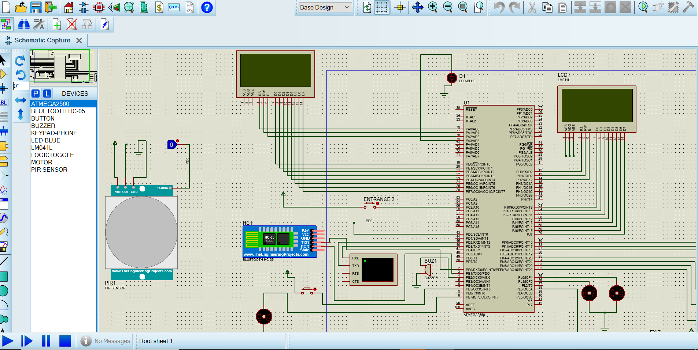
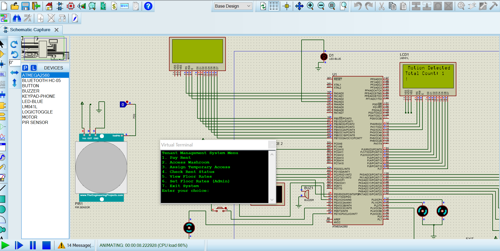

# Kasamba Mall Smart System

The **Kasamba Mall Smart System** is designed to transform Kasamba Mall into a smart, secure, and efficient environment using IoT technologies. The system enhances the experience of tenants, management, and customers by automating access control, managing tenant and customer facilities, and monitoring mall usage. Key features include occupancy tracking, access restrictions, and remote management via a smartphone app with Bluetooth capabilities.

# Kasamba Mall Smart System

The **Kasamba Mall Smart System** is designed to transform Kasamba Mall into a smart, secure, and efficient environment using IoT technologies. The system enhances the experience of tenants, management, and customers by automating access control, managing tenant and customer facilities, and monitoring mall usage. Key features include occupancy tracking, access restrictions, and remote management via a smartphone app with Bluetooth capabilities.

## Table of Contents

- [Description](#description)
- [Features](#features)
- [Technologies Used](#technologies-used)
- [Setup](#setup)
- [Usage](#usage)
- [Future Enhancements](#future-enhancements)
- [Images](#images)
- [Contributing](#contributing)
- [License](#license)

## Description

The Kasamba Mall Smart System automates and secures Kasamba Mall operations, offering advanced functionalities like tenant rent management, access control, and occupancy monitoring. The system leverages sensors and Bluetooth technology to improve operational efficiency and ensure secure access to mall facilities.

## Features

1. **Access Control and Occupancy Monitoring**

   - **Entrances and Exits**: Sensors at each entrance and exit count the number of people entering or leaving the building to maintain a secure and controlled flow.
   - **Escalator System**: Escalators with sensors detect individuals moving between floors, with each escalator limited to one-way movement.
   - **Smart Washrooms**: Washroom access is managed by a passcode system. Tenants receive unique access codes and can generate temporary codes for clients with preset expiration times.
   - **Occupancy Status**: Washroom occupancy is displayed on entry panels to restrict access when washrooms are in use.

2. **Tenant Rent and Dues Management**

   - **Rent Configuration**: Rent is set according to floor location:
     - **Ground Floor**: Base rent.
     - **Second Floor**: 75% of base rent.
     - **Third Floor**: 75% of the second floor’s rent.
   - **Due Payment and Access Restriction**: Tenants with overdue payments lose washroom access, impacting both tenants and their clients.
   - **Fee Update**: Management can update rent fees through a serial console.

3. **Management and Smartphone App Control**
   - Bluetooth-enabled smartphone app for real-time control, allowing management to:
     - Enable/disable escalators to encourage stair usage.
     - Restrict access for overdue accounts.
     - Override washroom access in emergencies.
     - Monitor current occupancy on different floors and facilities.
     - Set expiration times for temporary washroom access codes.
     - Temporarily override restricted access in emergency situations.

## Technologies Used

- **Microcontroller**: Controls sensors and manages system interactions.
- **Sensors**: Detects occupancy and movement at entrances, exits, and escalators.
- **Bluetooth Module**: Enables smartphone connectivity for remote control.
- **Atmel Studio**: Used for code development and deployment to the microcontroller.
- **Display Units**: Show messages regarding occupancy and access at washroom entrances.

## Setup

### Hardware Setup

1. Install sensors at mall entrances, exits, and escalators.
2. Set up the microcontroller to handle input/output for sensors, Bluetooth, and display units.

### Software Installation

1. **Code Deployment**: Upload the control code from Atmel Studio to the microcontroller.
2. **Serial Console Configuration**: Connect to the serial console to configure rent settings and tenant access permissions.
3. **Smartphone App Setup**: Install the Bluetooth app (developed via MIT App Inventor) on a smartphone to enable remote management.

## Usage

- **Occupancy Counting**: The system automatically counts people at entrances, exits, and on escalators.
- **Washroom Access**: Authorized tenants and clients can access washrooms with unique passcodes.
- **Rent Payment Updates**: Rent payments can be updated, restoring access permissions as necessary.
- **Management Control**: Use the serial console or smartphone app to configure settings, restrict access, or adjust escalator functionality.

## Future Enhancements

1. **Cloud Monitoring**: Remote access to occupancy and access history.
2. **Voice-Controlled Commands**: Allow voice-activated control for management.
3. **Expanded Tenant Features**: Tenants can view rent status and access codes they've issued.
4. **Energy Management**: Integrate energy-saving modes for escalators and lighting based on mall occupancy.
5. **Facial Recognition**: Use facial recognition for tenant and customer access.

## Images

- **Hardware Setup**

  

- **Simulation Result**

  

## Contributing

Contributions are welcome! Here’s how you can get involved:

1. Fork this repository.
2. Create a new branch with a descriptive name for your feature or fix.
3. Commit your changes with clear, concise messages.
4. Push your branch to your forked repository.
5. Submit a pull request to the master branch of the original repository.

### Bluetooth Functionality with MIT App Inventor

If you're interested in contributing, consider enhancing Bluetooth functionality using MIT App Inventor to implement advanced controls, such as:

- **Escalator Control**: Manage escalator operations remotely.
- **Access Management**: Enable or restrict access for tenants based on payment status.
- **Occupancy Monitoring**: Show real-time occupancy data for management.
- **Emergency Override**: Implement Bluetooth-enabled emergency access overrides.

Thank you for your interest in improving the Kasamba Mall Smart System!

## License

This project is licensed under the MIT License.

## Contact

## Contact

For questions or more information, contact me at [katex911@gmail.com](mailto:katex911@gmail.com).
For questions or more information, contact me at [katex911@gmail.com](mailto:katex911@gmail.com).
